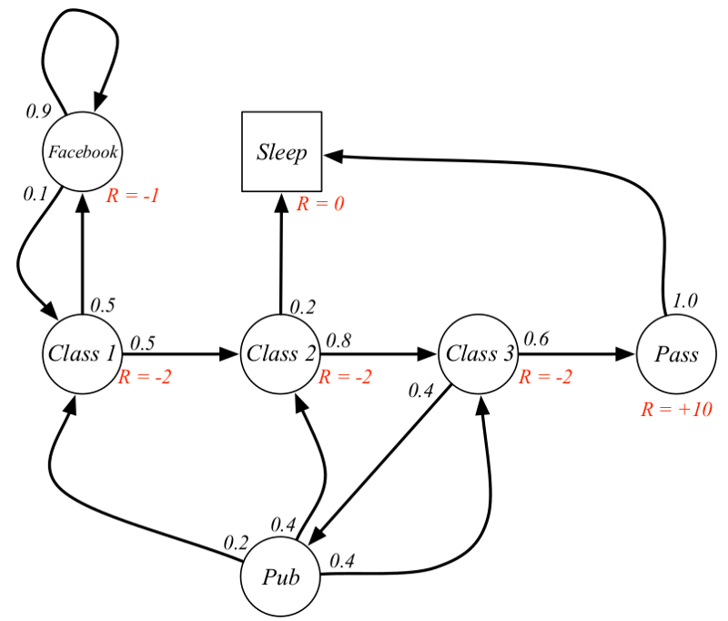
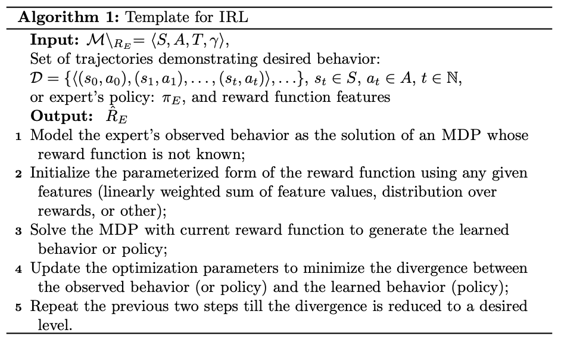
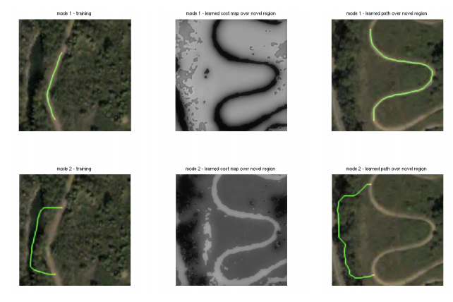

# Untitled Blog Post on Inverse Reinforcement Learning

In the beginning, scientists and engineers sought to model human neurons with computers to replicate human thought. Before long (give or take 40 years, multiple ML booms and busts, and the discovery of backprogpagation), researchers in Machine Learning were training deep neural networks to classify images by content and read handwritten characters. However, these algorithms relied on treasure troves of human data, and were still not nearly as robust as human annotators. As a result, the Artificial Intelligence community largely ignored research in data-based Machine Learning. They sought more robust symbolic algorithms, relying on explicit programming rather than human-generated data, to replicate human intelligence.

This began to change in the mid-2010s, although the seed for this change was sewn in the early 90s by TD-Gammon, an algorithm that could learn to play backgammon at a superhuman level by training a neural net to evaluate positions. Previous backgammon algorithms relied on neural nets, tools in Machine Learning which allow us to approximate complex functions based on a sample of inputs and outputs. Specifically, these algorithms teach neural nets to evaluate backgammon positions by asking human experts to evaluate each position the algorithm sees, and using input-output pairs of the form (position, expert value) to train a neural net. TD-Gammon simply 
1. searched two moves ahead, 
2. evaluated all of the possible positions using the neural net, and 
3. used these values to determine what the current position **should** be valued, and train the neural net to output this value when we input the current position. 

[Technical Note: At the beginning of training, TD-Gammon makes random predictions for the game states two steps ahead, so there's no reason to believe the target value for the current game state is correct. To see why this works, let $S_n$ be the set of game states where the game is guaranteed to end in $n$ moves. Note the property that if we start at a game state in $S_n$ and search two moves ahead, all of the leaves of this tree search belong to $S_{n-2}$. Terminal game states (those in $S_0$) always have a value of 0 or 1 (depending on who wins) and therefore provide a learning signal. Thus we will have the correct target value for game states in $S_2$, allowing us to learn the correct values for these states. Now, due to the property we just mentioned, we will have the correct target value for game states in $S_4$, allowing us to learn the correct values for these states. We can continue inductively to show that we learn the correct values for states in $S_n$ for any $n\in\mathbb{N}$. Moreover, much of the knowledge we acquired (e.g. in Chess, it's generally bad to be in check) when learning to evaluate states in $S_2$ will transfer to $S_4$, and the even more complex knowledge from $S_4$ will transfer to $S_6$, making this a feasible approach in practice. Because we need to run steps 1-3 multiple times to force knowledge transfer all the way up to $S_n$, this is a bootstrapping technique for game state evaluations. For games like Backgammon, Chess, or Go, it is typically the case that the knowledge needed to go from $S_{100}$ to $S_{102}$ is mostly captured by what the algorithm already knows to solve $S_{100}$, so this bootstrapping can still work relatively fast for deep game trees.]

Because TD-Gammon did not rely on human data, it came out of its intensive self-play training with some interesting ideas. For example, conventional backgammon wisdom dictated that in certain situations (a die roll of 2-1, 4-1, or 5-1), a move called "slotting" (moving a checker from point 6 to point 5) was appropriate, risking loss to develop a more aggressive position. TD-Gammon, however, prefered a more converservative move (point 24 to point 23). When humans began trying the conservative approach at tournaments, they began to win more frequently, and slowly "slotting" departed the culture of backgammon. This discovery was only possible because TD-Gammon trained entirely independently from human data, experimenting with the backgammon environment itself to discover how to evaluate game states at a superhuman level.

Fast forward 30 years, and today the world's foremost chess players practice by memorizing lines from superhuman chess algorithms like Google's AlphaZero, which are constructed using a technique very similar to one used in TD-Gammon, commonly referred to as **self-play**. It is an increasingly popular approach for training **Reinforcement Learning** (RL) agents to play games.

## Introduction to Reinforcement Learning

Let's back up a little: RL is a field of Machine Learning built to solve **Markov Decision Processes** (MDPs). For an introduction to MDPs, see [this previous blog post](https://ml.berkeley.edu/blog/posts/mdps/). For those who just need a quick refresher, MDPs are networks formalizing complex control problems. MDPs are designed to represent an **environment** in which an **agent** attempts to accomplish some task, traversing a network of **states** by taking **actions** and receiving some **reward** at each time step, as well as an **observation** of the next state. Take, for example, the following (highly simplified) network, where our agent is a college student and the environment is college:

We can make the network arbitrarily complex to more accurately model any specific real-world situation. Assuming our control problem is accurately described by the network we draw, here's how the core components of the corresponding MDP are defined, with explanations of key concepts in RL along the way:

- The nodes of the network are the **states** the agent can be in.
- Every time the agent visits a new state it receives an **observation** of that state. (Often, these are the states themselves, but sometimes we can only partially observe the state.)
- The connections between nodes represent **actions** which take the agent from state to state. 
- These states, observations, and actions each live in their own spaces, which we denote the **state space** $S$, the **action space** $A$, and the **observation space** $O$, respsectively. 
- We define a **transition operator** $\mathcal{T}(s', o \mid s, a)$ which tells us the distribution over possible next states $s'$ and observations $o$ when the agent takes action $a$ in state $s$. (We omit $o$ when the observations are simply the whole states $s'$.)
- When the agent takes an action $a$ in state $s$, it receives a **reward** $r(s, a)$, representing a numerical measure of how well the agent is doing.
- The spaces $S$, $A$, $O$, the transition operator $\mathcal{T}(s', o \mid s, a)$, and the reward function $r(s, a)$ all together form the MDP or  **environment** with which the agent interacts.
- The path the agent takes through the MDP is called the agent's **trajectory** $\tau$. 
- We number the steps taken along the trajectory with an index $t$, and we index the states visited as $s_t$, the observations received as $o_t$, the actions taken as $a_t$, and the rewards received as $r_t$. 
- Thus $\tau = ((s_t, a_t, o_t, r_t))_{t=0}^{\infty}$, that is, the trajectory is a sequence of states, observations, actions, and rewards. (Again, we omit $o_t$ when $o_t = s_t$.)

- In Reinforcement Learning, we wish to learn a **policy** $\pi: S\to A$ telling us what action to take in each state. 
  - Note: any policy $\pi$ induces a state visitation distribution $S_\pi$ on the set of states $S$; this is the stationary visitation distribution after $\pi$ runs for infinitely long. Equivalently, it is the solution to the following property of the stationary visitation distribution:
  $$S_\pi(s) = \underset{a\sim \pi}{\mathbb{E}}\sum_{\substack{s'\in S}}\mathcal T(s \mid s', a)$$
- Specifically, we would like our policy to maximize the total reward, written as $\sum_t r_t$.
- We often use **discounted total reward** $\sum_{t} \gamma^t r_t$ for $\gamma$ close to 1, since this offers stability and theoretical guarantees when we have many time steps; namely, as long as rewards are bounded ($r_t < R$), we have $\sum_t \gamma^t r_t < \frac{R}{1 - \gamma}$.
- To describe the expected discounted total reward under a given policy $\pi$, we define
$$Q^{\pi}(s, a) = \underset{\substack{s_0 = s, a_0 = a\\s_{t+1}\sim \mathcal T(s_{t+1} \mid s_t,a_t) \\ a_{t+1}\sim \pi(a_{t+1} \mid s_{t+1})}}{\mathbb{E}}\left[\sum_{t=0}^{\infty}\gamma^tr(s_t, a_t)\right]$$
$$V^{\pi}(s) = \underset{\substack{s_0 = s, a_0\sim \pi(a_0 \mid s)\\s_{t+1}\sim \mathcal T(s_{t+1} \mid s_t,a_t) \\ a_{t+1}\sim \pi(a_{t+1} \mid s_{t+1})}}{\mathbb{E}}\left[\sum_{t=0}^{\infty}\gamma^tr(s_t, a_t)\right] = \underset{a\sim \pi(a\mid s)}{\mathbb{E}} \left[Q^{\pi}(s, a)\right]$$
- If we break off the first term of each of these expressions and recognize the remaining sum as another evaluation of $Q$ or $V$, we derive the **Bellman Recurrence**:
$$Q^{\pi}(s, a) = r(s, a) + \gamma \underset{\substack{s'\sim \mathcal T(s' \mid s,a) \\ a'\sim \pi(a' \mid s')}}{\mathbb{E}}\left[Q^{\pi}(s', a')\right]$$
$$V^{\pi}(s) = \underset{a\sim \pi(a\mid s)}{\mathbb{E}}\left[r(s, a) + \gamma \underset{\substack{s'\sim \mathcal T(s' \mid s,a) \\ a'\sim \pi(a' \mid s')}}{\mathbb{E}}\left[Q^{\pi}(s', a')\right]\right]$$
- The advantage of the Bellman Recurrence is that we can take the maximum of both sides over the policy $\pi$. We let $Q^* = Q^{\pi^*}$ and $V^* = V^{\pi^*}$ where $\pi^*$ is the optimal policy. Since both $Q$ and $V$ represent discounted total reward and the optimal policy maximizes discounted total reward, we have
$$Q^{*}(s, a) = r(s, a) + \gamma \underset{s'\sim \mathcal T(s' \mid s,a)}{\mathbb{E}}\left[\max_{a'\in A}Q^{*}(s', a')\right]$$
$$V^{*}(s) = \max_{a\in A}\left[r(s, a) + \gamma \underset{s'\sim \mathcal T(s' \mid s,a)}{\mathbb{E}}V^{*}(s')\right]$$
- Most standard methods in RL are either **policy gradient** or **q-learning** methods. They differ in how function approximators, most often neural networks, are applied.
  - Policy Gradient methods attempt to learn the function $\pi(a\mid s)$ by directly optimizing discounted total rewards.
  - Q-Learning methods attempt to learn $Q^*(s, a)$ and extract a policy by choosing $\pi(a\mid s) = \argmax_{a\in A} Q^*(s, a)$.

The beauty in these concepts lies in their generality. In the case of backgammon or other board games, we want a player (agent) to interact with the game (environment) in such a way that maximizes their chance of winning (reward). These games have full observability, so the **obseravation space** $O$ is the same as the **state space** $S$, which is the discrete set of possible game states. The **action space** $A$ is discrete and finite, since there are only finitely many moves to play in each state. The reward is simply 1 for winning or -1 for losing, so to maximize total reward we ought to win.

If we were, however, piloting a spaceship, we want a pilot (agent) to interact with the flight controls, spacecraft, and atmospheric surroundings (environment) in such a way that lands the spacecraft smoothly (reward). In this case, the state space $S$ consists of snapshots of real life, and the observation space $O$ is the continuous space of instrument readings and camera feeds. The action space $A$ will consist of the possible combinations of settings of switches, knobs, and joysticks in the cockpit, so it will be a continuous space. 
 
As you can see, RL is an extermely general framework that applies to much of intelligent human behavior, and many problems, ranging from simple to exteremely complex, fit this framework. There are many applications to environments with discrete states and actions, like board games, as well as environments with continuous states and actions, like various robotic control problems, and many infrastructural optimization problems. 

 ## So what is self-play?

Self-play is a technique arising out of the addition of **search** to traditional RL. Search is the technique of exploring many or all of the possible states that can arise from a given state, which helps us ensure that we are training our function approximators on a representative sample of game-play. In self-play algorithms, we search the game tree to a limited depth (like TD-Gammon, which used a depth of 2) and then ask our function approximators for the values of the leaf game states. We then use these to bootstrap the correct neural net output at the root of search, as described in the technical note. This method is known as self-play, and it allows RL+search methods to operate entirely independently of human data, bootstrapping their own understanding of game-play by playing against themselves to explore the game tree. Because of the independent nature of these algorithms, they have been heralded as potential seeds for true Artificial Intelligence. For this and many other reasons, AI has gradually begun to look to ML as a tool to replicate human intelligence.

How do we control this intellectual independence? This question may seem silly at first, as computers will never do things we do not tell them to do, at least at a high level. There is no chance AlphaZero will stop optimizing its chess performance and begin conquering the world, as we humans have set its reward function to encourage AlphaZero to learn to evaluate chess positions accurately, not to conquer the world. However, just as TD-Gammon discovered that slotting was ineffective, AlphaZero has found quite different routes to maximizing its reward than humans had expected. It is an expert at developing and navigating complex pawn positions to restrict its opponents mobility, and readily sacrifices pieces for slight positional advantages it later converts into crushing victories. Watch it demolish Stockfish, the world's most powerful traditional chess engine, built on heuristics hand-engineered by human experts, in [this video](https://www.youtube.com/embed/lb3_eRNoH_w). 

Now imagine a more powerful RL algorithm tasked with controlling our power grids to reduce human energy consumption. Who is to say it won't sacrifice humans, cutting off power supply to large swaths of the population, in order to acheive this goal?

The problem here is that very simple numerical rewards can often lead to dangerous or unwanted behavior when RL algorithms interface with the real world. We could simply alter the reward function to elicit the behavior we would like, but the resulting reward function will likely still leave out some dangerous edge cases, especially as these algorithms grow more powerful and we assign more tasks to them. Now imagine the energy consumption algorithm is also given power over city planning and traffic control; as the use cases grow, it becomes significantly more likely the algorithm will do something unwanted in the name of reducing energy consumption.

## Communicating Intention

We therefore need better methods of conveying our wishes to RL algorithms if RL is to ever be used effectively at scale. Humans convey their wishes to each other using language, but there are plenty of stories involving genies in lamps which warn us of dangers of specifying tasks using vague language with the potential to be taken too literally. Any succint language instructions will likely have the same issues with edge cases as numerical rewards, and while modifying the instruction to take edge cases into account will be easier given the flexibility of language, the resulting instructions may become too long and difficult to learn from.

A widely-used approach in current robotics is to use images of the intended results of the task as the task specification (these are known as "goal images"), but this approach seems less applicable to more complex tasks involving long-term planning, and is again subject to dangerous or unwanted behavior justified by the pursuit of the goal image. While a more detailed goal representation may help the RL algorithm tasked with controlling our power grids in understanding our intentions (e.g. one could show the algorithm what a steady supply of power looks like), but this still fails to specify how the algorithm achieves this goal (e.g. it may change the power grids too quickly and cause equipment to fail, resulting in blackouts).

Let's think about the precise desired behavior of these algorithms. More than anything, we would like to equip them with the knowledge of human experts, who are trained to perform these tasks well. Perhaps from this baseline we could optimize for certain goals (e.g. reducing energy consumption), but we would like to craft our base reward function in a way which ensures the algorithms behave like humans at a basic level. 
 
Key observation: If we could find a reward function under which demonstrated expert behavior was optimal, we could optimize for this reward to reproduce human behavior, and then add other terms with varying coefficients to introduce other goals.

This observation lead to the development of Inverse Reinforcement Learning (IRL). In traditional RL, we are given a reward function, and we seek to learn a policy which is optimal for this reward function. In IRL, we are given a set of expert demonstrations, and we seek to learn a reward function for which these demonstrations are optimal.

Here's a template algorithm for IRL:

## Margin Optimization

The first observation one may make regarding our objective in IRL is that the zero function is always a valid option for a reward function, as all trajectories are optimal when the agent always receives zero reward. This challenge may be phrased more generally:

> **Challenge: Solution ambiguity**. There are many reward functions for which observed expert trajectories may be near-optimal, making solutions to IRL problems ambiguous.

One approach to cope with this challenge is Margin Optimization, in which we attempt to learn a reward function which explains expert trajectories by some margin better than alternatives. One of the earliest and simplest margins is
$$\underset{s\sim S_{\pi_E}}{\mathbb{E}} \left[Q^{\pi_E}(s, a^*) - \max_{a\in A\backslash\{a^*\}}Q^{\pi_E}(s, a)\right]$$
where $\pi_E$ is the expert policy. But we don't know the expert's policy, we just have a set $\Tau_E$ of observed expert trajectories. How can we use this to approximate the margin above? Well, our expert trajectories were supposedly sampled from $\pi_E$; namely, their beginning states $s$ should be distributed according to the state-visitation distribution $S_{\pi_E}$, and the rest of each trajectory should function as an estimate of $Q^{\pi_E}(s, a^*)$. So the first term is equivalent to summing rewards along our expert trajectories. 

How can we estimate the second term, $\max_{A\backslash\{a^*\}}Q^{\pi_E}(s, a)$? Taking the maximum of the Q-values for the beginning states of negative samples should work, as long as these beginning states are near those of the expert trajectories. We can estimate the Q-values at the beginning states of the negative samples by summing rewards again, yielding a simpler margin:
$$\sum_{(s, a)\in\tau_E}r(s, a) - \max_{\tau\in\Tau} \sum_{(s, a)\in\tau}r(s, a)$$

This is the objective of **Maximum Margin Planning (MMP)**, which expresses reward as a weighted sum of preset features $\phi_i(s, a)$:
$$r(s, a) = \sum_{i=1}^nw_i\phi_i(s, a)$$
and solves a quadratic program maximizing the margin objective above and minimizing the length of the weight vector $\mathbf{w} = (w_1, \dots, w_n)$ a la Ridge Regression. This is provably convergent, and produces basic results exhibiting desired behavior. See the images below, where an agent is asked to trace out a path on a map, and the reward is set via MMP with demonstrations either following the road or hiding in the trees. When trained on the "following the road" reward, the agent follows the *new* road, and when trained on the "hiding in the trees" reward, the agent successfully avoids the plains (which were not present in the training environment) and hides in the trees.

Later, the authors of Maximum Margin Planning would introduce the Learn to Search (LEARCH) algorithm, which is identical to MMP except we add demonstrations under the current reward function to the bank of negative examples, further penalizing reward functions which produce behavior differing from the expert demonstrations. LEARCH also relied on more complex optimization, using exponentiated functional gradient descent rather than standard Quadratic Program solvers like MMP. Eventually, gradient normalization methods would be combined with LEARCH to allow expert demonstrations to be sub-optimal.

